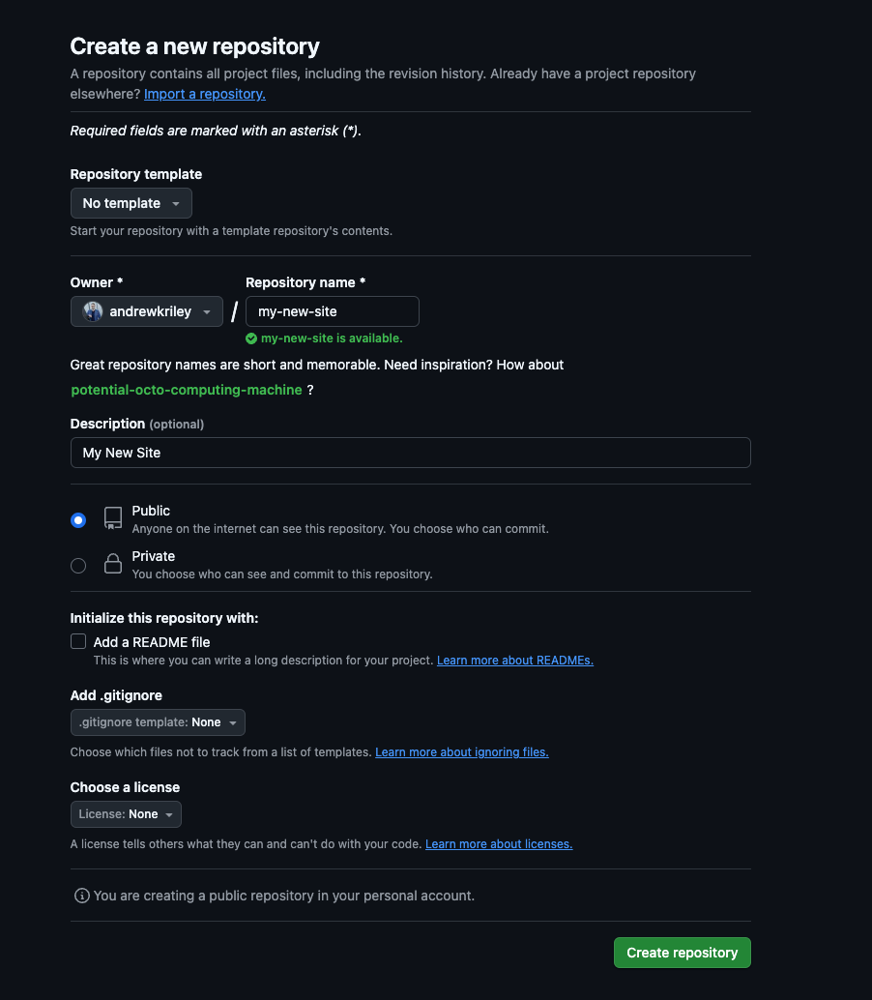
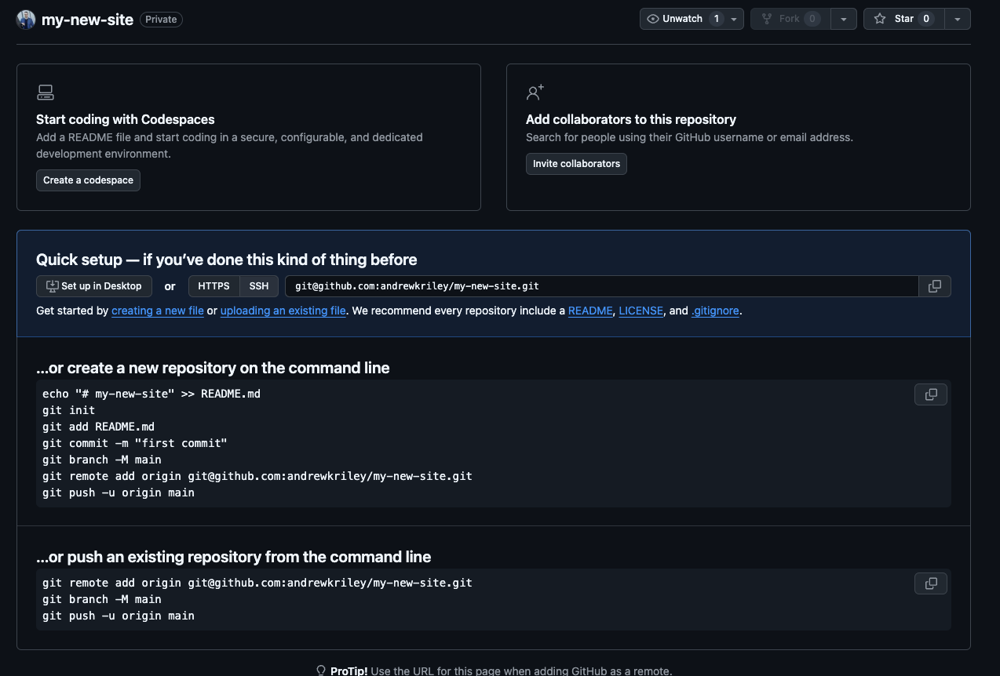

## TLDR;

What is Hugo https://gohugo.io/ - "The world’s fastest framework for building websites"

Here's the high level steps
1) Download Hugo binary for your OS
2) Confirm you can run the hugo binary 
3) Create a new site using hugo
4) Initiate a new git repository inside your newly provisioned hugo site
5) Push your new site to github.com
6) Connect your Github to CloudFlare Pages
7) Deploy your hugo site to CloudFlare Pages
8) Test it's available

> ***Did I try using Docker?***<br>
Yes, Docker is the default answer to everything right? I discovered permission issues with the base setup when running `hugo new site <newsite>`, mounting the path as a volume and then trying to edit it in Visual Studio Code. Am sure there's a way around this but for these first steps I just wanted a result. Hence the above approach using the locally run Hugo binary on my dev workstation meant permissions where simple and I could get underway quickly.

## Here's the detail

Download Hugo binary for your OS.

https://gohugo.io/installation<br>
Precompiled Binaries here <br>
https://github.com/gohugoio/hugo/releases/tag/v0.145.0

In my case I used the ```hugo_extended_0.145.0_darwin-universal.tar.gz``` binary, but do what fits your dev environment.

Extract the binary to a folder

```bash
mkdir hugo_extended
tar -xzvf hugo_extended_0.145.0_darwin-universal.tar.gz -C ./hugo_extended
```
Confirm you can run the hugo binary 

```
cd hugo_extended
hugo version
```
Which should give you this output<br>

```
hugo v0.145.0-666444f0a52132f9fec9f71cf25b441cc6a4f355+extended darwin/arm64 BuildDate=2025-02-26T15:41:25Z VendorInfo=gohugoio
```

Create a new site using hugo

Run the following ```hugo``` command to set up the directory structure and files in the ```my-new-site``` folder.

```bash
hugo new site my-new-site
```

This will then give the following output if successful

```
Congratulations! Your new Hugo site was created in /Users/<yourusername>/Desktop/dev/my-new-site.

Just a few more steps...

1. Change the current directory to /Users/<yourusername>>/Desktop/dev/my-new-site.
2. Create or install a theme:
   - Create a new theme with the command "hugo new theme <THEMENAME>"
   - Or, install a theme from https://themes.gohugo.io/
3. Edit hugo.toml, setting the "theme" property to the theme name.
4. Create new content with the command "hugo new content <SECTIONNAME>/<FILENAME>.<FORMAT>".
5. Start the embedded web server with the command "hugo server --buildDrafts".


```
Initiate a new git repository inside your newly provisioned hugo site

Change directory to the ```my-new-site``` folder

```bash
cd my-new-site
```
Then create a new repository and push it to the main branch

Go to https://github.com and create a new repository ```my-new-site``` if you are following along with this guide. Otherwise substitute for your own repository name.





```bash
echo "# my-new-site" >> README.md
git init
git add README.md
git commit -m "first commit"
git branch -M main
```

This will initalise the repository, add a README.md file and commit the changes to the respositories ```main``` branch.

```
Initialized empty Git repository in /Users/andreril/Desktop/dev/my-new-site/.git/
[main (root-commit) 33c6e22] first commit
 1 file changed, 1 insertion(+)
 create mode 100644 README.md
 ```

Push your new site to github.com

```bash
git remote add origin git@github.com:<YOURGITUSERHERE>/my-new-site.git
git push -u origin main
```

Will give you a result like this

```
Enumerating objects: 3, done.
Counting objects: 100% (3/3), done.
Writing objects: 100% (3/3), 225 bytes | 225.00 KiB/s, done.
Total 3 (delta 0), reused 0 (delta 0), pack-reused 0
To github.com:andrewkriley/my-new-site.git
 * [new branch]      main -> main
branch 'main' set up to track 'origin/main'.
```

You can then add the rest of the Hugo created files 

```bash
git add .
git commit -m "hugo commit"
```
Resulting in 
```
[main a5a500f] hugo commit
 2 files changed, 8 insertions(+)
 create mode 100644 archetypes/default.md
 create mode 100644 hugo.toml
```
then
```bash
git push origin main
```
Results 
```
Enumerating objects: 6, done.
Counting objects: 100% (6/6), done.
Delta compression using up to 8 threads
Compressing objects: 100% (4/4), done.
Writing objects: 100% (5/5), 534 bytes | 534.00 KiB/s, done.
Total 5 (delta 0), reused 0 (delta 0), pack-reused 0
To github.com:andrewkriley/my-new-site.git
   33c6e22..a5a500f  main -> main
```

> ***UNFINISHED BELOW***<br>

6) Connect your Github to CloudFlare Pages
7) Deploy your hugo site to CloudFlare Pages
8) Test its available


Resources used

https://developers.cloudflare.com/pages/framework-guides/deploy-a-hugo-site/<br>
https://github.com/CaiJimmy/hugo-theme-stack<br>
https://github.com/CaiJimmy/hugo-theme-stack-starter<br>
https://gohugo.io/installation<br>


## Future projects
- Publish the docker image for Hugo I created
- Publish a how-to using the above and a local docker compose example
- CF page with a custom domain

---

