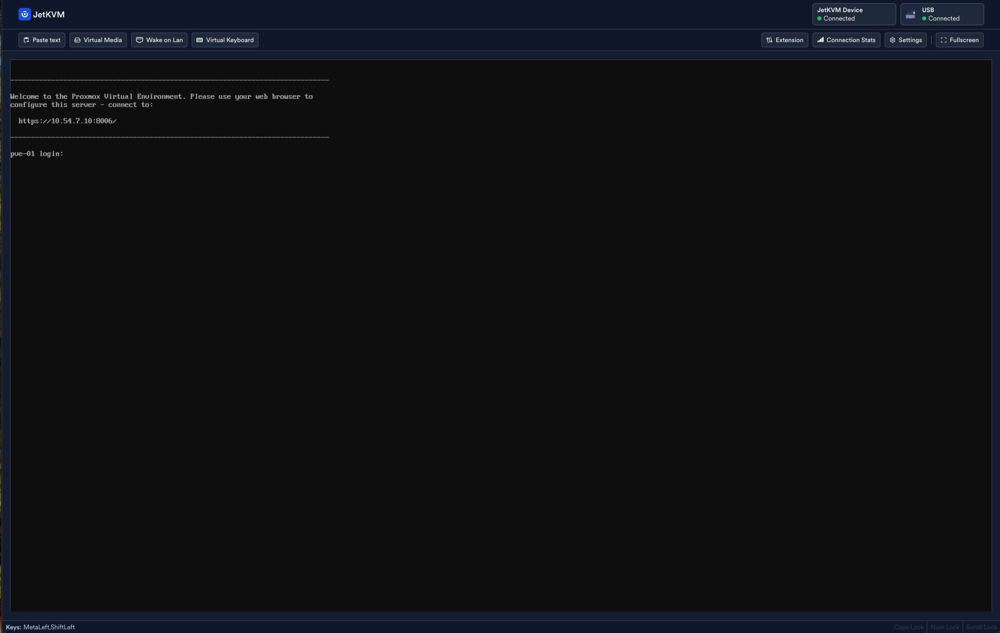
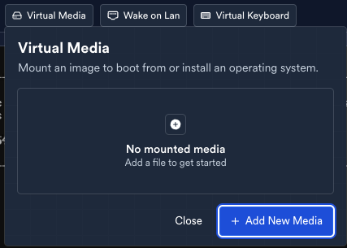
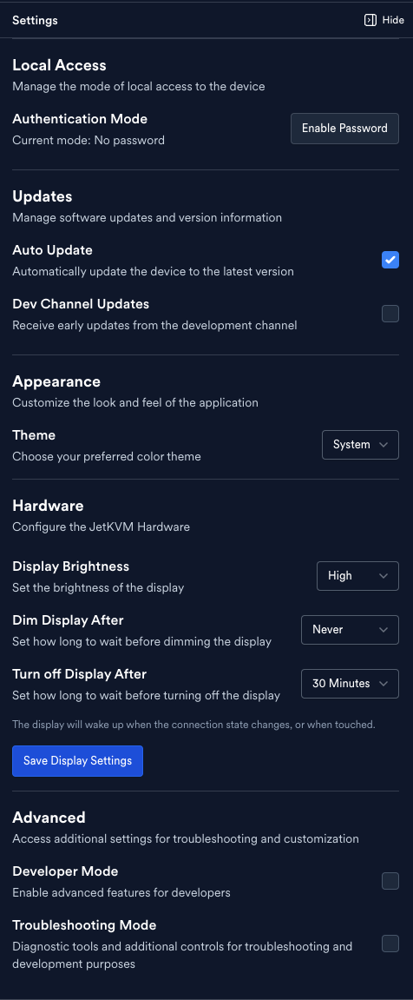
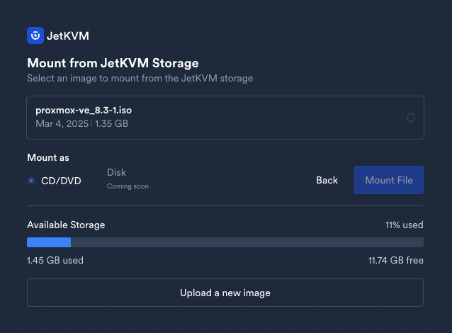
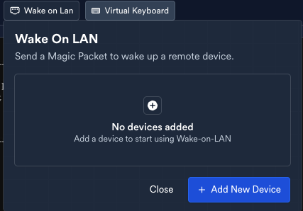
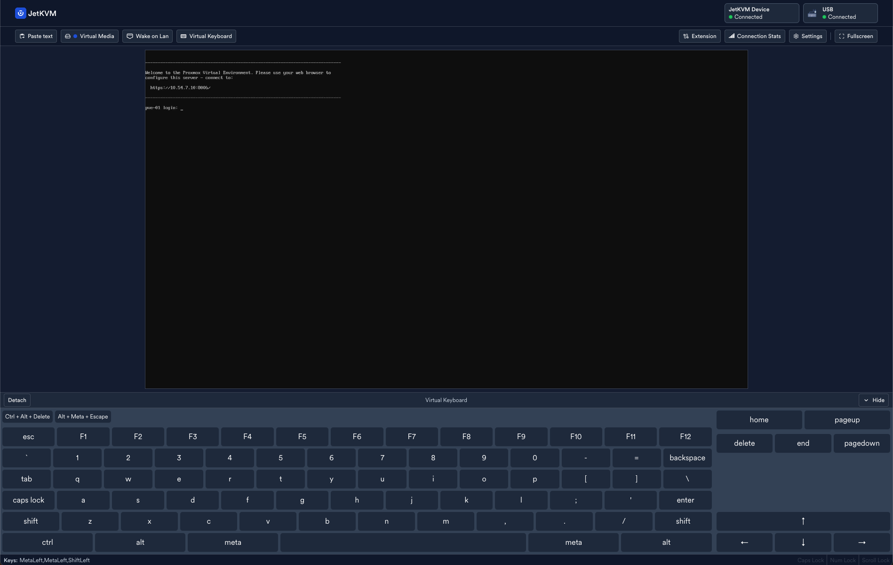
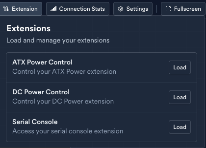
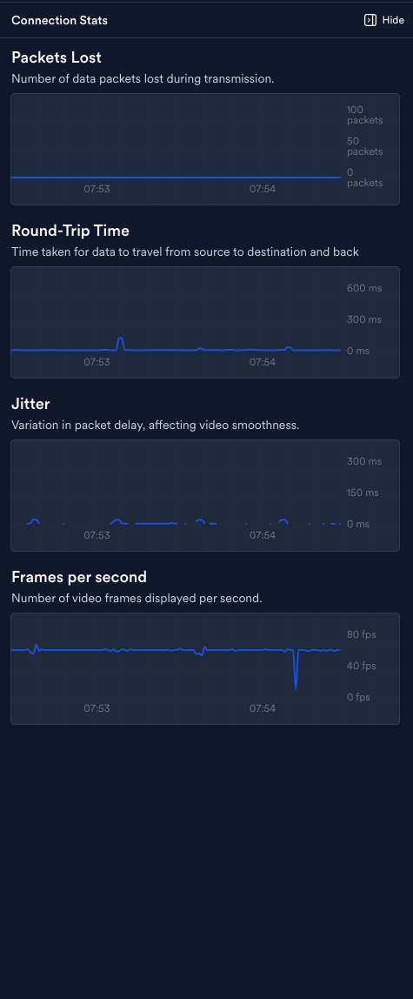

Checkout https://jetkvm.com/

TLDR;

- Powered by USB-C
- Ethernet conenctivity 
- Can connect via Serial or ATX power controls
- USB-C provides keyboard, video, mouse and can mount a virtual disk e.g. an ISO file

