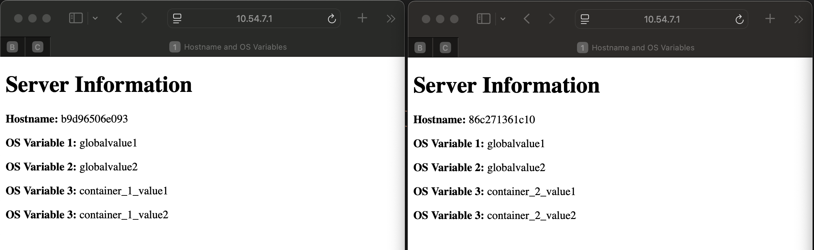

https://github.com/andrewkriley/nested-var-compose

The intent of this project is demonstrate how nested variables can be used and inspire you to use something similar in your own projects.

This project has the following structure

.env # a global environment variables file that sets environment variables that will be available to all containers and docker-compose files. 
docker-compose.yaml # a main docker compose file that uses the include: function to lauch 2 other containers. 
container_1 # a directory hosting files for a container that pulls the global and local variables. 
container_2 # a second directory hosting files for a container that pulls the global and local variables. 
container_3 # a third directory hosting files for a container that pulls the global and local variables. 
container_4 # a fourth directory hosting files for a container that pulls the global and local variables.

Each 'container_N' directory has the following structure

.env # a local (to the container) environment variables file that sets environment variables that will be available to all containers and docker-compose files. 
docker-compose.yaml # a docker-compose.yaml file used to launch the image.

